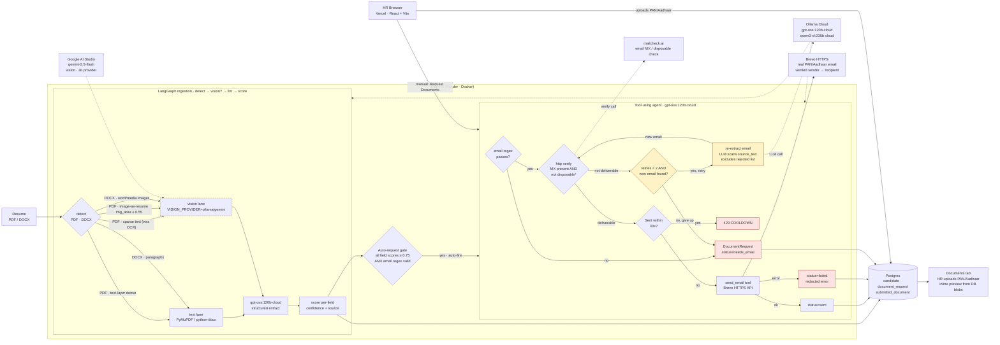

##Architecture 

```mermaid
flowchart LR

%% =========== LEFT WING — inputs ===========
R["Resume<br>PDF / DOCX"]
H["HR Browser<br>Vercel · React + Vite"]
L["Ollama Cloud<br>gpt-oss:120b-cloud<br>qwen3-vl:235b-cloud"]
G["Google AI Studio<br>gemini-2.5-flash<br>vision · alt provider"]
V["mailcheck.ai<br>email MX / disposable check"]

%% =========== BODY — FastAPI core ===========
subgraph Core["FastAPI (Render · Docker)"]
direction TB

    subgraph Ingest["LangGraph ingestion · detect → vision? → llm → score"]
    direction TB

        DET{"detect<br>PDF · DOCX"}

        TXT["text lane<br>PyMuPDF / python-docx"]
        VIS["vision lane<br>VISION_PROVIDER=ollama|gemini"]
        LLM["gpt-oss:120b-cloud<br>structured extract"]
        SC["score per-field<br>confidence + source"]

        DET -- "PDF · text-layer dense" --> TXT
        DET -- "PDF · sparse text (was OCR)" --> VIS
        DET -- "PDF · image-as-resume img_area ≥ 0.55" --> VIS
        DET -- "DOCX · paragraphs" --> TXT
        DET -- "DOCX · word/media images" --> VIS

        TXT --> LLM
        VIS --> LLM
        LLM --> SC
    end

    AGATE{"Auto-request gate<br>all field scores ≥ 0.75<br>AND email regex valid"}

    subgraph Agent["Tool-using agent · gpt-oss:120b-cloud"]
    direction TB

        EGUARD{"email regex<br>passes?"}

        HVER{"http verify<br>MX present AND<br>not disposable*"}

        REEXT["re-extract email<br>LLM scans source_text<br>excludes rejected list"]

        TRIES{"retries < 2 AND<br>new email found?"}

        NEEDS["DocumentRequest<br>status=needs_email"]

        COOL{"Sent within<br>30s?"}

        CLD["429 COOLDOWN"]

        CALL["send_email tool<br>Brevo HTTPS API"]

        FAIL["status=failed<br>redacted error"]

        SENT["status=sent"]

        EGUARD -- "no" --> NEEDS
        EGUARD -- "yes" --> HVER

        HVER -- "deliverable" --> COOL
        HVER -- "not deliverable" --> TRIES

        TRIES -- "yes, retry" --> REEXT
        REEXT -- "new email" --> HVER

        TRIES -- "no, give up" --> NEEDS

        COOL -- "yes" --> CLD
        COOL -- "no" --> CALL

        CALL -- "ok" --> SENT
        CALL -- "error" --> FAIL
    end

    SC --> AGATE
    AGATE -- "yes · auto-fire" --> Agent
end

%% =========== RIGHT WING — outputs ===========
DB[("Postgres<br>candidate · document_request<br>submitted_document")]

SMTP["Brevo HTTPS<br>real PAN/Aadhaar email<br>verified sender → recipient"]

DOC["Documents tab<br>HR uploads PAN/Aadhaar<br>inline preview from DB blobs"]

R --> DET

H -- "manual: Request Documents" --> Agent

L -.-> Ingest
L -.-> Agent

G -.-> VIS

HVER -. "verify call" .-> V
REEXT -. "LLM call" .-> L

SC --> DB
SENT --> DB
FAIL --> DB
NEEDS --> DB

CALL --> SMTP

H -- "uploads PAN/Aadhaar" --> DB
DB --> DOC

classDef fallback stroke-dasharray:5 3,stroke:#c97000;
classDef terminal fill:#fde2e2,stroke:#991b1b;
classDef retry fill:#fef3c7,stroke:#92400e;

class VIS fallback;
class CLD,FAIL,NEEDS terminal;
class REEXT,TRIES retry;
```